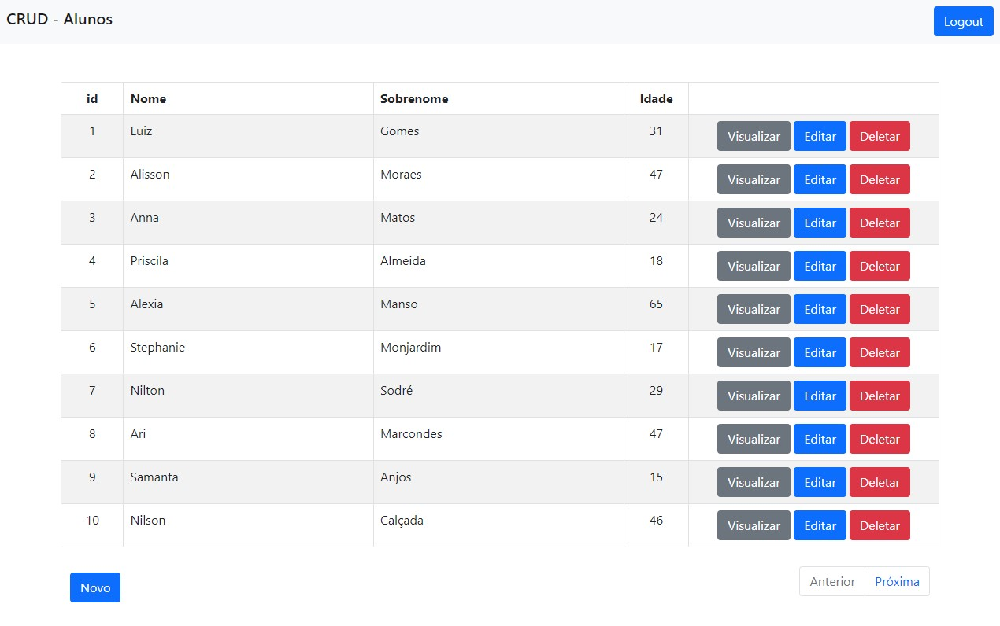
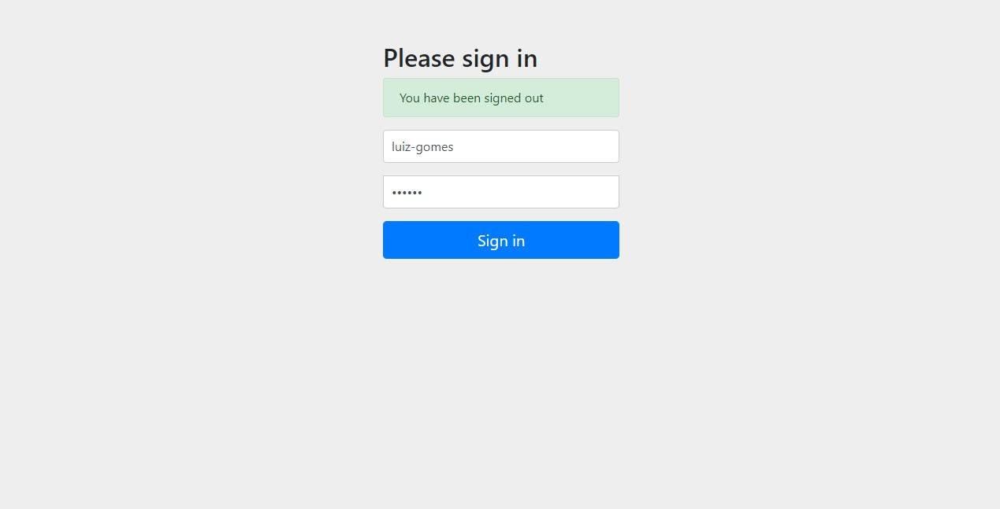
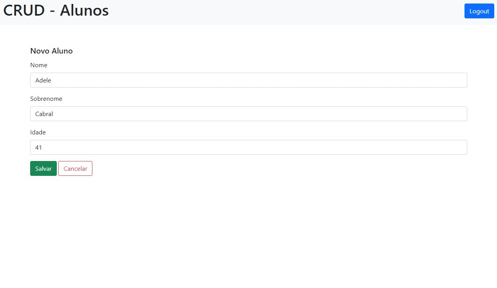
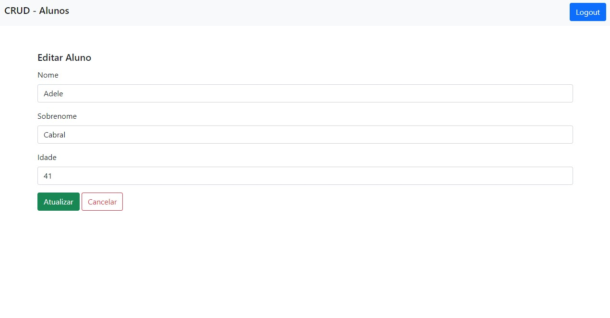
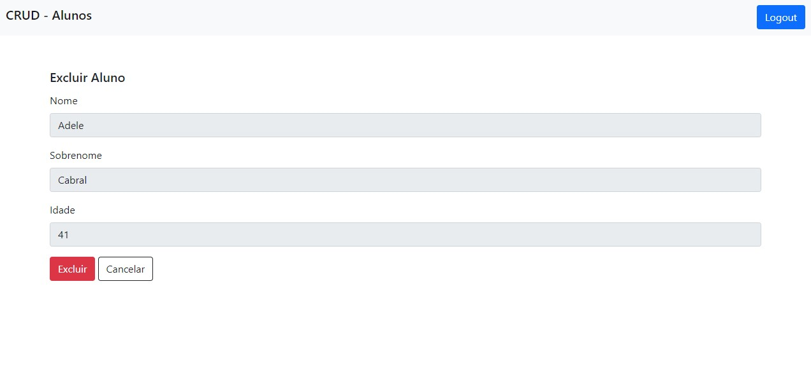

# Sobre o Projeto 🚀

Projeto de estudo em Java utilizando o padrão MVC.
Foi criado um CRUD de Alunos, tela de login utilizando o Spring Security e alguns testes unitários.

# Tecnologias Utilizadas

- Java
- Spring Boot
- Thymeleaf
- Bootstrap
- Spring-boot-starter-security

# Tela de Aplicação 

# Tela de Login

# Tela de Adicionar

# Tela de Editar

# Tela de Deletar

